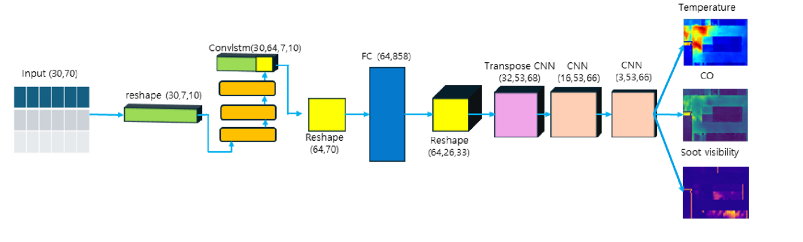
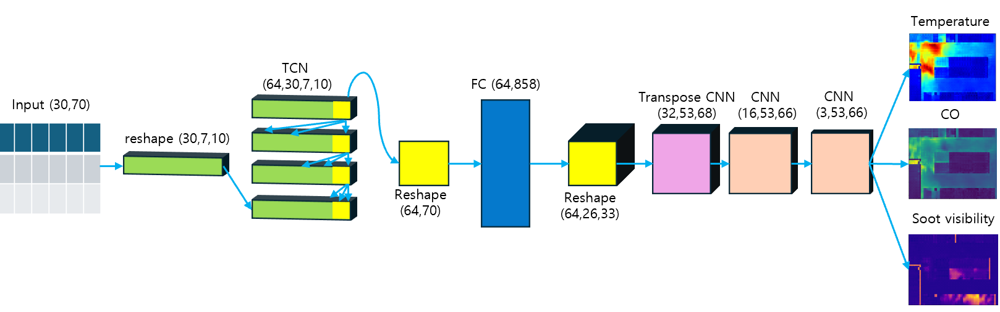

# Fire Field Prediction Models

Sensor-sequence models for predicting 2D fire-field outputs:

- `TEMPERATURE`
- `CO_FRACTION`
- `SOOT_VISIBILITY`

## Install

```bash
pip install -r requirements.txt
```

## Evaluate TCN

```bash
python scripts/evaluate_tcn.py --dataset data/train_data --checkpoint checkpoints/TCN_base.pth
```

## Evaluate ConvLSTM

```bash
python scripts/evaluate_convlstm.py --dataset data/train_data --checkpoint checkpoints/convlstm_base.pth
python scripts/evaluate_convlstm.py --dataset data/test_data --checkpoint checkpoints/convlstm_base.pth
```

## Train

```bash
python scripts/train_tcn.py
python scripts/train_lstm.py
python scripts/train_convlstm.py
```

Training scripts use `data/train_data` by default.

## Model Architecture

### ConvLSTM



### TCN



## Demo

### Simulation

https://github.com/user-attachments/assets/9708a141-80a6-41dc-9e02-68a5c68625e1

### test_3MW

https://github.com/user-attachments/assets/b169ea25-0705-43b0-92bb-e8676e41ae6b

| Model | Temperature R2 | Temperature RMSE | CO R2 | CO RMSE | FPS |
| --- | ---: | ---: | ---: | ---: | ---: |
| LSTM | 0.8581 | 79.0945 | 0.7897 | 0.003452 | 433.82 |
| ConvLSTM | 0.8654 | 77.0301 | 0.8169 | 0.003221 | 28.93 |
| TCN | 0.8987 | 66.8148 | 0.8475 | 0.002940 | 38.35 |

### test_6MW

https://github.com/user-attachments/assets/65307168-75de-43e7-b072-cbe44cf06e4f

| Model | Temperature R2 | Temperature RMSE | CO R2 | CO RMSE | FPS |
| --- | ---: | ---: | ---: | ---: | ---: |
| LSTM | 0.7267 | 104.6139 | 0.8020 | 0.003829 | 533.16 |
| ConvLSTM | 0.7452 | 101.0027 | 0.8003 | 0.003845 | 33.43 |
| TCN | 0.8598 | 74.9250 | 0.8591 | 0.003230 | 42.09 |

### test_8MW

https://github.com/user-attachments/assets/21f5b9a2-238f-403a-a8e0-f89450e2d2db

| Model | Temperature R2 | Temperature RMSE | CO R2 | CO RMSE | FPS |
| --- | ---: | ---: | ---: | ---: | ---: |
| LSTM | 0.6306 | 127.2756 | 0.7324 | 0.004359 | 532.74 |
| ConvLSTM | 0.7641 | 101.7143 | 0.7510 | 0.004204 | 34.10 |
| TCN | 0.7683 | 100.7950 | 0.7771 | 0.003978 | 42.10 |
